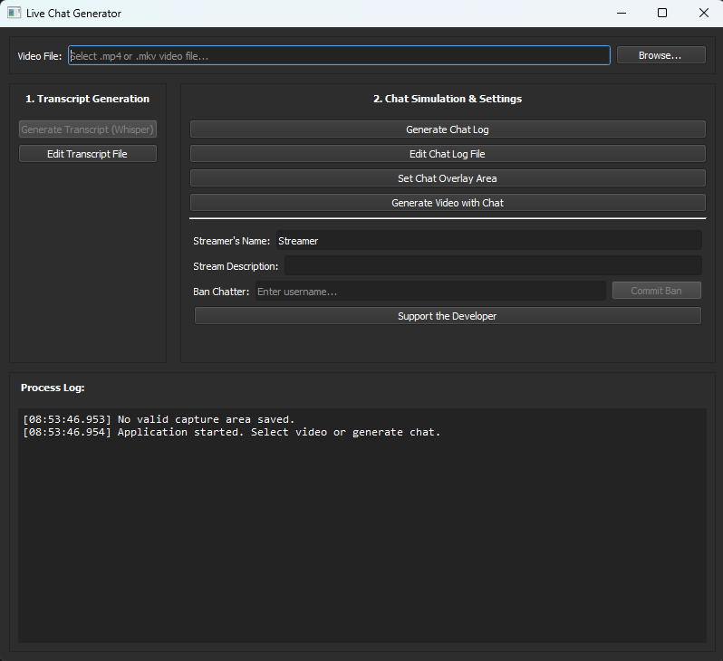

Back to Portfolio: <https://devoreni.github.io/portfolio/>

# Abstract

## Introduction
Live-streamed content thrives on audience interaction, however managing a live chat presents significant moderation challenges and reputational risks. This project introduces the following solution: a post-production AI Chat Simulation application. The system leverages multi-modal AI (generative AI that can take in a variety of media inputs such as text, images, and video) to generate a realistic, dynamic chat overlay for pre-recorded videos, giving creators complete control over the final content. The application features a multi-threaded architecture to ensure a responsive user experience, integrated audio transcription via OpenAI's Whisper, multi-modal chat generation with local large language models (LLMs), and a custom video rendering pipeline built with OpenCV and Pillow. The result is a robust tool which eliminates the risks associated with a live chat while still offering the perception of engagement.

## Problem Statement
Live streaming platforms foster a unique connection between the streamer and the audience through real-time chat interaction. Displaying the chat on-screen is standard practice to enhance viewer engagement for both the live viewers and video on demand (VOD) viewers. This practice introduces the significant challenge of chat moderation from potentially thousands of participants. A sigle inappropriate or malicious message appearing on stream can permenantly tarnish the reputation of the presentor, their community, and their brand, especially if the message makes it into the VOD where thousands more people could see the message.

## Proposed Solution
To mitigate the risks while preserving the aesthetic of live interation, this project takes a post-production approach. By extracting features from a pre-recorded video, a simulated chate is generated and overlaid onto the footage. Users can, at any point, alter any aspect of the chat to their desire, including usernames of chatters, messages left, the color of usernames, badges chatters have, the time a message is sent, or delete or create messages at their discretion. Realistic chat messages react dynamically to the video content and to other previous chat messages. The entire workflow is streamlined and easy to use.

## Project Requirements
The following requirements are met by the AI Chat project:

- **Automated Context Extraction:** The system will automatically transcribe the video's audio and analyze video frames to understand on-screen events.
- **Enhanced Contextual Awareness:** Users will be able to provide additional text-based context, such as a video description or streamer persona, to refine AI-generated responses.
- **Unique Chatter Personas:** Each simulated chatter will possesses a unique, procedurally generated personality, speaking style, and visual identity (username color, badges).
- **Full Editorial Control:** Users will be able to add, modify, or delete any generated chat message in any way.
- **Chatter Curation:** Users will have the ability to permanently remove ("ban") specific AI chatters from the system.

# UX pipeline
While the back-end is a complex integration of multiple systems, the user workflow is designed to be linear and intuitive.

1.  **Video Selection:** The user selects a source video file (`.mp4`, `.mkv`) via a built in file browser.
1.  **Audio Transcription:** The application automatically transcribes the video's audio using a local Whisper model, producing a `.vtt` file. The user can manually edit this file to correct any inaccuracies, add aditional lines, remove them, or alter timestamps.
1.  **Context Refinement (Optional):** The user can provide supplementary context, such as the streamer's name and a brief video description, via text fields in the GUI.
1.  **Chat Generation:** The user initiates the chat generation process. The system analyzes the transcript, video frames, and user-provided context to produce a complete chat log as a `.csv` file.
1.  **Chat Curation:** After generation, the user can edit the `.csv` file to modify message content, timing, chatter appearance, or other metadata. Users can also "ban" chatters, removing them from the database entirely.
1.  **Video Rendering:** The user defines an overlay position and initiates the final rendering. The system composites the chat overlay onto the original video, producing a final `.mp4` file.



# Implementation

The project is architecturally divided into three primary components: the AI Chatter Generation module, the Database, and the main multi-threaded application logic.

## Chatter Creation

### Usernames

One of the most important parts of making the chatters feel like real people is for them to have varied and unique usernames. Procedurally generated attributes are assigned to a chatter then are fed to an LLM to generate a unique, natural-sounding username. The username is checked for uniqueness before being committed.

### Message Style

Based on their assigned attributes, "seed messages" are created and stored. These messages provide that chat generation model with a baseline for the chatter's message sytle, preventing stylistic drift and ensuring consistency. This technique avoids "flanderization," where a character becomes an exaggerated caricature of themselves over time.

### Database Structure

Chatters and their messages are stored in an sqlite3 database with the following structure:

```{mermaid}
---
title: Chatter Database
---
erDiagram
    CHATTERS ||--o{ CHAT_LOGS : "have messages in"
    CHATTERS {
        TEXT username PK
        TEXT gender
        TEXT subscription_tier
        INT age
        TEXT chatter_description
        TEXT username_color
        INT message_frequency
        INT badge_one
        INT badge_two
    }
    CHAT_LOGS {
        INT message_id PK
        TEXT username
        TEXT message
    }
    RECENT_MESSAGES {
        INT message_id PK
        TEXT username
        TEXT message
    }
```

**CHATTERS:** Stores persistent data about each AI entity and certain details relating to their attributes. 

**CHAT_LOGS:** stores the initial "seed" example messages for each chatter. This table is not updated with new messages except upon intitial creation of a chatter.

**RECENT_MESSAGES:** Keeps a rolling log of the last 20 generated messages. Tis table provides immediate conversational context and allows for interaction between chatters.

### Normal Forms

This database is in the Fifth Normal Form and necessarily adheres to all preceding normal forms.

**1NF** 

* All columns contain atomic values and cannot be divided further.
* Each row in each table is unique.
* Each column in each table has a unique name.
* The order in which data is stored does not matter.<br>
(The higher primary key value in the Recent Messages table indicates a more recent message; however, this does not break normal form because it does not matter in what order it is stored. The value of the primary key is an important semantic property as it carries temporal information.)

**2NF**

* 1NF is satisfied.
* Each column in each table is fully dependant on the primary key of the table.

**3NF**

* 2NF is satisfied.
* Each column in each table is only dependant on the primary key of the table.

**Boyce-Codd Normal Form (BCNF)**

* No column depends on anything except the primary key of the table.

**4NF**

* BCNF is satisfied.
* Each column is independant of every other column, except for the primary key.

**5NF**

* 4NF is satisfied.
* No decomposition or joins are needed to fully reconstruct a table.

## Main GUI

There are many steps to the chat generation process, so, having an intuative and easy to use gui is important for user satisfaction.

### Layout

The layout is designed to guide users as simply as possible from the start to the end while allowing them to redo or go back to any step. The transcription process is not perfect and error can make their way into the video transcript. By allowing users to open the `.vtt` file generated by OpenAI's Whisper, users can correct any mistake. They can also edit timestamps or make any other changes they wish. 
<br><br>
Similarly, generated chat messages can sometimes need tweaking. After useers generate the chat, they have the option to make any edits they wish to the `.csv` file. This includes changing: the color of a username, the displayed badges, message bodies, emojis used, subscription tier, the timing of a message, and more.

### Text Fields

In order to improve the accuracy and personability of the chatters, two text fields are included for customization: the streamer's name and a video description. If these fields are left blank they will be omited from the llm prompt during message generation. The stream description text field is limited to 150 characters to avoid prompt injection.
<br><br>
Sometimes, chatter consistently leave less than ideal chat messages, in which case, users have the option to "ban" chatters by tying in their username and pressing commit ban.

### Built in Log

Some of the processes can take a long time, especailly transcription and chat generation. To ensure users know what is happening instead of seeing the application freeze, a log is built into the gui. It updates the user anytime an action is performed. For example, during video transcription, the log with first output a message acknowledging the start of the video transcription process. It then prints lines of the transcript and their time stamps in real time so users can moniter progress.

## Worker Threads

In order to keep the log active and the gui from freezing during lengthy processes, backend logic is handled in seperate threads. Threads set a flag to disable buttons in the main gui, but the log is still updated and the application window can still be interacted with.

### Whisper

Whisper Transcription is handled within a thread. Whisper is a speech to text, open source, ai model developed by OpenAI. When called, it extracts the audio from the selected video file, cleans it with ffmpeg, then begins the transcription process. Infered context and previously generated tokens help determine the next token in the sequence. The output is stored in a `.vtt` format which includes a timestamp and the generated tokens for that timestamp. Users can edit this file to correct mistakes or correct words or phrases that were mispoken. After each line is transcribed, it and the current timestamp is sent to the log to be displayed so the user can track the progress of Whisper.

### Chat Message Generation

The ChatGenWorker orchestrates the message creation process. For each segment of the transcript, it constructs a multi-modal prompt for a local LLM (gemma3:4b via Ollama). This prompt is a composite of

1. The current and recent lines from the audio transcript.
1. The last 10-20 messages from the general chat (RECENT_MESSAGES).
1. A video frame extracted from the corresponding timestamp
1. The selected chatter's persona information and seed messages.
1. User-provided stream description and streamer name.

By combining audio, visual, and conversational context, the LLM generates a relevant and in-character message.

### Rendering Pipeline

The project uses a custom rendering pipeline utilizing OpenCV and Pillow. It processes the source video frame-by-frame:

1. For each frame, it determines the set of chat messages that should be visible based on their generation timestamp and a fixed display duration.
1. It creates a transparent overlay layer. On this layer, it renders each active chat message, including a semi-transparent background, user badges, the colored username, and the message text.
1. New messages appear at the bottom and push older messages upward.
1. This chat overlay is then composited onto the source video frame.
1. The final frames are encoded into an .mp4 video file using imageio. Progress is reported to a progress bar in the GUI.

### Chatter Removal

Chatters can be removed from the database by entering their username in "Ban Chatter" section of the GUI and clicking "Ban Chatter." The user is informed of a successful removal in the log if a chatter with a matching username is found, otherwise, they are informed that there was an error with the removal process.

# Results

The project successfully produces an application that meets all stated objectives. It adds a dynamic and customizable simulated chat to pre-recorded videos, offering creators a tool for enhancing content while maintaining full editorial control.
<br>
The performance of the application is inherently dependent on the user's hardware, particularly the GPU, as it relies on locally-run language models and video processing.
Future development will focus on two key areas:

1. Containerization: The complex dependency graph makes installation challenging. The application will be containerized using Docker to simplify distribution and ensure a consistent runtime environment.
1. Enhanced Customization: Future versions will include more options for the chat overlay's appearance and behavior, offering greater visual flexibility.

//Demo will be included here//

# Conclusion

The AI Chat Simulation project was a significant and complex solo project, successfully integrating multiple complex systems: multi-threaded application design, local large language models for both text and multi-modal generation, a custom relational database schema, and a video processing pipeline. The current iteration is robust and functional and provides a user-friendly interface without sacrificing granular control. With planned improvements in distribution and customization, this tool has the potential to become a valuable asset for content creators.
