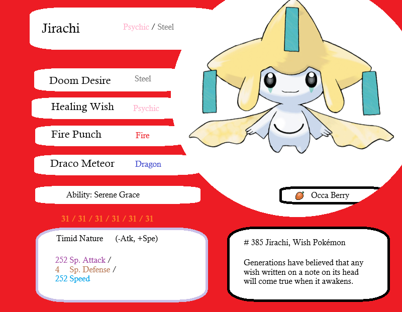
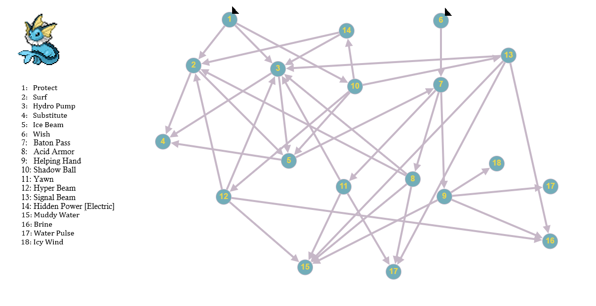
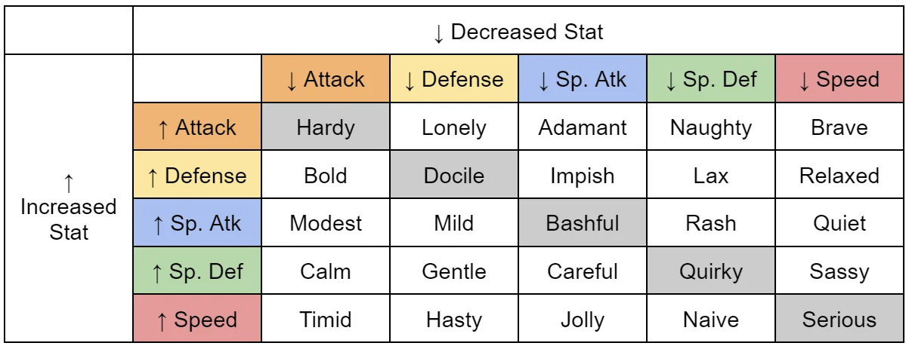
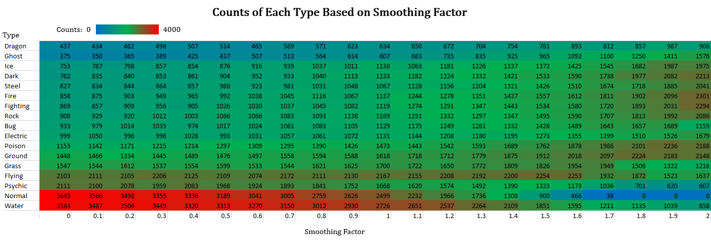
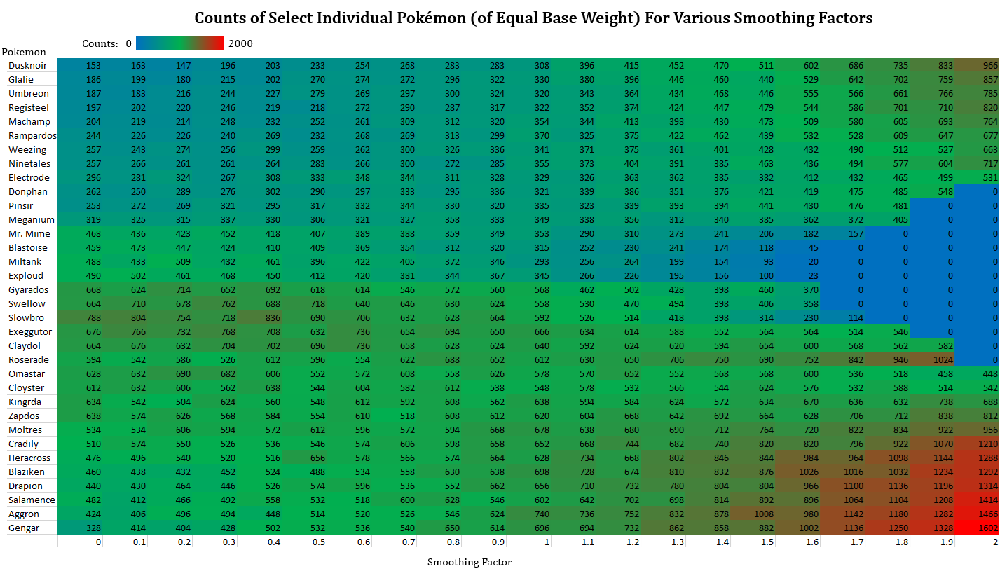
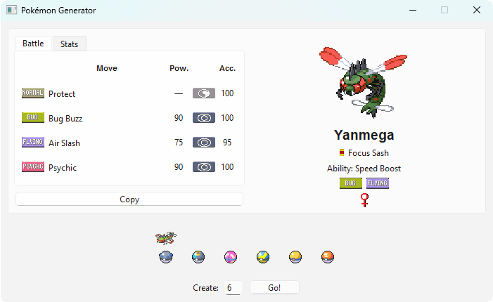
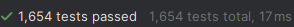
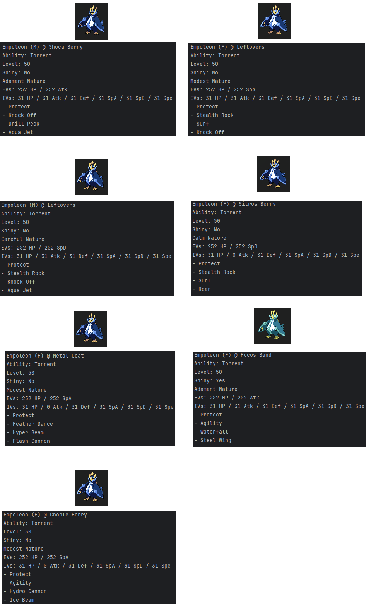
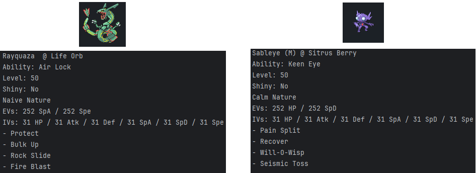

Back to Portfolio: <https://devoreni.github.io/portfolio/><br>
GitHub Project Link: <https://github.com/devoreni/PokemonRandBatGIV>

# Background

## Basics of Pokémon Battles
Though seemingly silly on the surface, a lot goes into competitive Pokémon battling. The two most important aspects of battling are teambuilding and piloting. To practice piloting specifically, many trainers enjoy random battles; a team of six random Pokémon is given to each player and from there, they do battle. The problem is this: Pokémon have dozens of potential attacks available to them, some much better others, and while the specific Pokémon on a team are random, their sets are not. This means that once you see a Pokémon on your or your opponent's team, you know exactly what its stats are, its attacks are, its held item is, and its ability. Even though there are hundreds of Pokémon, after enough battles, every set will be fully known and the ability to conceal information, a crucial aspect of proper team building and piloting, is lost. There have been attempts in the past to solve this: when a Pokémon is "Generated", it has its set entirely randomized, however, this led to the issue where Pokémon with large movepools, or attack options available to them, became completely unviable and often, dead weight. It let to scenarios where a Pokémon may only have one usable attack for the situation so skill on the part of both players was completely removed. Needless to say, this solution was not the optimal one. This project fixes this issue. Using an intelligent algorithm, varied and exciting sets can be created at the press of a button, and, every set is guaranteed to be viable.

## Building a set

A Pokémon set consists of the following:

- A chosen Pokémon which determine
    - The base stats of the Pokémon (Hit Points, Attack, Defense, Special Attack, Special Defense, Speed)
    - The type(s) of the Pokémon (one or two types of 18 possible types which determine offensive and defensive capabilities)
- Four Moves
    - Each Pokémon has around 50 - 80 possible moves, of which 4 can be chosen to "know" for the battle.
- An ability
    - Each Pokémon has 1 - 3 passive abilities, one of which can be chosen.
- 508 Effort Values
    - Every four effort values increase a stat by a single point, up to 252 effort values per stat. 508 is enough to maximize two stats with enough for a single point somewhere else.
- A nature
    - the nature of a Pokémon will remove 10% of a chosen stat and boost another by 10%
- Individual Values
    - Each stat can have up to 31 points added to it. However, in some scenarios, lowering a stat by not giving it the full 31 may be beneficial. Examples include Hidden Power, a move where the move's type is dependent on the chosen IVs, and in situations where moving after the opponent is beneficial to gain knowledge.
- Additional considerations
    - Extra "for fun" things can be added to a Pokémon to give it a unique feel.
        - Shiny Pokémon have a different coloration (this changes nothing else)
        - The pokeball containing a Pokémon has a unique look and animation as it opens
        - The gender of a Pokémon can have niche battle effects, but is usually just preference


{width=80%}

# Project Requirements

## Validation and Verification

The solution will meet the following validation requirements:

- The user will interact with an intuitive GUI.
- The user will be able to specify the number of Pokémon to be generated.
- The Pokémon generated will have a balanced distribution.
    - There will not be an overabundance of any type in the batch.
- The movesets of the Pokémon will be competitively viable and balanced across all Pokémon.
    - Pokémon with higher stats and better move options (like the legendary Kyogre) should compete on even ground with less powerful Pokémon.
- A Pokémon's EVs and nature will match the identity of the Pokémon
    - A Pokémon may function as a wall or an attacker based on its moves. The EV spread and nature should be chosen to match the use of the Pokémon.
- A Pokémon's IVs should match the identity of the Pokémon and be valid if the Pokémon has the Hidden Power attack.
- An optimal item will be chosen for the Pokémon.
- Pokémon will feel unique
    - A Pokémon will have a chance to be shiny
    - A Pokémon will have a ball
    - A Pokémon will have a gender

The solution will meet the following verification requirements:

- The program will not crash under normal circumstances.
    - The program will be fully unit tested and fuzzed for a significant amount of time
- The program will adhere to all coding standards.
    - No fragile relative paths will be used.
    - The project will have a logical file and folder structure, a readme, a .gitignore, a config file, and a requirements.txt.
    - Proper version controlling will be handled with a version control file and version controller to enforce database integrity.
- The program will follow the following rules as if it were safety-critical.
    - There will be no goto statements, setjmp or longjmp constructs, or direct or indirect recursion.
    - All loops have a fixed upper bound. 
        - `While True:` will never be used
        - a loop must be guaranteed to exit without the use of a `break`
    - No function will be longer than what can be printed on a sheet of paper and will be readable.
        - Functions will have low coupling and high cohesion.
        - Exactly one statement per line.
    - All data objects will be declared at the smallest possible scope.
        - Dataflow will remain simple and easy to follow.
    - All functions will check the validity of all parameters they are passed.
    - Macros will be limited to the use of config filepaths only.
    - The program will run without any warnings or errors.
        - Running the program with the `-Wb` flag should never produce a warning or an error.

Although the program is not safety-critical, this design desicion was made as a commitment to professional software engineering practices.

## Selecting Individual Pokémon

While selecting and individual Pokémon may seem as simple as randomly grabbing one from a bag and adding it to the team, it has an issue: some Pokémon types are represented far more than others. For example, there are only 6 fully evolved Dragon type Pokémon in the fourth generation compared to 44 Water types. Because the balance of types is critical for having a balanced team, this solution will not work. Another alternative is to randomly select a type, then, from within that type, choose a random Pokémon. However, this has multiple issues. Firstly, if the Dragon type is as likely to be selected as the Water type, individual Dragon type Pokémon will show up far more than any individual water type leading to a stale format where the same Pokémon seemingly show up all the time. Additionally, many Pokémon are dual type Pokémon, meaning have have two types, further complicating things. With the first solution, every Pokémon is equally likely to show up, yet the type representation is wildly off. In the second solution, each type shows up an equal amount but the relative frequencies of each Pokémon is off balance. The program will solve this issue.

# Solution

## Moveset

Each Pokémon object is assigned a set of graphs, each with a starting node or nodes. Running depth first search on one of those graphs and taking the first four encountered nodes will return a viable moveset. Checking against a set of visited nodes prevents loops from being an issue and maintaining a stack of nodes along the current path allows for backtracking if a dead end is encountered. Depth first search allows for the exploration of paths of synergistic moves to their conclusion, ensureing a coherent moveset.


    
This single graph can produce a wide variety of Vaporeon movesets. Take the following examples:

- 6 &rarr; 7 &rarr; 9 &rarr; 15
    - Wish
    - Baton Pass
    - Helping Hand
    - Muddy Water
        - A supportive Vaporeon that heals allies, bolsters their damage, and provides consistent chip damage with the potential upside of a Muddy Water accuracy drop on the opponent.
- 1 &rarr; 10 &rarr; 12 &rarr; 3
    - Protect
    - Shadow Ball
    - Hyper Beam
    - Hydro Pump
        - All out offensive Vaporeon with powerful attacks that put consistent pressure on the opponent.
- 1 &rarr; 2 &rarr; 4 &rarr; 5
    - Protect
    - Surf
    - Substitute
    - Ice Beam
        - A balanced Vaporeon focused on dealing consistent damage over the course of a battle.

This approach also allows for balancing of more and less powerful Pokémon in several ways. More powerful Pokémon can have more variance in their sets while less powerful Pokémon can have tighter, more optimized graphs. The graphs of more power Pokémon can include more usually useless moves. In double battles, the move protect is almost mandatory and leaving it out of the graph can significantly dampen their power.

## EVs and Nature

The problem of choosing the optimal nature and optimal EVs can be greatly simplified when making the following assumptions: Due to the extreme variety of Pokémon that could show up on the opponent's team, it is better to have the two most useful stats maxed out rather than attempting to match specific break points; and a Pokémon's EVs and nature can be determined only by its base stats, moveset, and ability.
<br><br>
A deterministic algorithm assigns a score for each stat based on the Pokémon's base stats. Then, the algorithm loops through the previously determined moveset of the Pokémon to try to find connections and a core identity -- adding and subtracting points as it goes. For example, the move Swords Dance, even though it is a status move, enhances the users offensive capabilities and thus increases the score for the attack stat, unless, the user does not have a way to take advantage of the attack boost, such as baton passers, who will pass the stat boost to an ally but will not use it themselves. A Pokémon with the move Gyro Ball, which deals greater damage the lower the user's speed stat, will significantly reduce the point total for the speed stat.
<br><br>
The two stats with the highest point total by the end of the algorithm are assigned 252 EVs. The stat with the highest point total is assigned the positive aspect of the nature and the stat with the lowest point total is assigned the negative aspect.



## IVs and Extras

A Pokémon will almost always want maximum IVs in every stat, however, there are certain circumstances in which this is not optimal. Pokémon take confusion damage based on their attack stat; dropping the attack IV to 0 is optimal for Pokémon without a way to deal physical damage. The moves Gyro Ball and Trick Room benefit Pokémon with less speed so dropping the speed IV to 0 is optimal in that case. Pokémon with the Hidden Power attack (a move that changes type and damage depending on the users IVs) require specific IVs to maximize the damage of Hidden Power and its coverage.
<br><br>
A Pokémon's shininess, ball, and gender are randomly decided.

## Held Item

With over a hundred unique items to choose from, and each Pokémon only being able to hold a single item, choosing the most optimal one becomes a significant task even for a human. With limited time for data collection and training, a random forest model was selected as the machine learning algorithm of choice due to its ability to effectively leverage available data, its predictability, speed, and—most importantly—its high accuracy—consistently outperforming other techniques tested under the same constraints.
<br>
The input layer for the random forest consists of the following features:

- The types of the Pokémon
- The ability of the Pokémon
- The calculated stats of the Pokémon (after applying EVs, IVs, and nature to the base stats)
- The number of moves in each move category (physical, special, or status)
- The number of setup moves for each stat
    - For example, Dragon Dance is an attack setup move and a speed setup move
    - HP recovery moves are counted as HP setup moves
    - Evasion and accuracy are counted as stats that can have setup moves
    - Abilities that affect stats are also counted
- The number of each type of special effect move that a Pokémon has
    - Included are: draining moves, baton pass, trapping moves, item bestowing moves, multi-hit moves, screens, high critical rate moves, self stat dropping moves, low accuracy moves, charge moves, and multi target moves.
- The number of unique weaknesses, quad weaknesses, resistances, and quad resistances
- A "Bulk Score" which is a rough calculation of how tough a Pokémon is to knock out
- An "Offense Score" which is a rough calculation of a Pokémon's offensive capabilities
- The type coverage of the Pokémon's damage dealing moves

After a Pokémon is passed through the model, the likely items are assigned weights based on the model's confidence and added to a list. If the model has low confidence overall, super effective type berries are added to the list. Super effective type berries are one time consumable items that reduce the damage of an incoming super effective hit by 50%. Only relevant type berries are added to the list, highly prioritizing a berry if the Pokémon also has a quad weakness. If a Pokémon would be weak to a type but is immune from another type or ability, the berry is not added. Finally, from the list, a random item is chosen based on their weights.

### Special Cases

Some Pokémon must hold a certain item, or, their viability is tied to holding an item. In this case, the default implementation does not meet the specific requirements, so a `Strategy Pattern` is employed. Due to the way that ZODB (the NoSQL database used for this project) stores objects persistently (it cannot pickle instance methods directly), a very specific design pattern must be used.
```{python}
def foo():
    return 'foo'
def bar():
    return 'bar'

function_holder = {'foo': foo, 'bar': bar}

class A():
    def __init__(self, custom_func = None):
        self.custom_func = custom_func

    def __str__(self):
        if to_str := function_holder.get(self.custom_func):
            return to_str()
        else:
            return 'no custom func'
    

obj_1 = A()
obj_2 = A(custom_func = 'foo')
obj_3 = A(custom_func = 'bar')

print(obj_1)
print(obj_2)
print(obj_3)
```

## Pokémon Selection

Pokémon selection happens in two stages; first, each Pokémon is assigned a base weight. This weight is manually assigned, loosely based on the popularity and viability of a Pokémon. In general: popular Pokémon have a base weight of ~2, balanced Pokémon have a base weight of ~2, underpowered Pokémon have a base weight of 1 - 2, weak Pokémon have a base weight < 1, overpowered Pokémon have a base weight < 1. Then smoothing of types occurs as follows:

### Variable and Set Definitions

Let $P$ be the set of all Pokémon, $p \in P$.
Let $T$ be the set of all Pokémon types, $t \in T$.

Let $M: P \to \mathcal{P}(T)$ be a function that maps each Pokémon to its set of types, where $\mathcal{P}(T)$ is the power set of $T$. The number of types for a Pokémon $p$ is given by $|M(p)|$.

Let $w: P \to \mathbb{R}^+$ be a function that assigns a base weight to each Pokémon, where $w_p$ is the base weight for Pokémon $p$.

### 1. Raw Type Counts

The raw count for each type, $R_t$, is calculated by summing the fractional contribution of each Pokémon to that type. A Pokémon contributes $1 / |M(p)|$ to each of its types.

$$
R_t = \sum_{p \in P \text{ where } t \in M(p)} \frac{1}{|M(p)|} \quad \forall t \in T
$$

This creates a set of raw type counts, $R = \{R_t | t \in T\}$.

### 2. Smoothed Type Weights

First, calculate the median of the raw type counts, denoted as $\tilde{R}$.

$$
\tilde{R} = \text{median}(R)
$$

Next, each individual raw type count $R_t$ is smoothed to produce a smoothed type weight $S_t$. This is done by extrapolating the difference between the median and the raw count. Let $s$ be a smoothing constant, where $s = 1.5$.

$$
S_t = (\tilde{R} - R_t) \cdot s + R_t \quad \forall t \in T
$$

This results in a set of smoothed type weights, $S = \{S_t | t \in T\}$.

### 3. Pokémon Scaled Weights

For each Pokémon $p$, a type-based scalar, $\alpha_p$, is calculated. This scalar is the arithmetic mean of the smoothed type weights corresponding to the Pokémon's types.

$$
\alpha_p = \frac{1}{|M(p)|} \sum_{t \in M(p)} S_t
$$

The unnormalized scaled weight for each Pokémon, $U_p$, is the product of its base weight $w_p$ and its type-based scalar $\alpha_p$.

$$
U_p = w_p \cdot \alpha_p
$$

### 4. Final Probability Distribution

The final probability of any given Pokémon $p$ being chosen, denoted as $W_p$, is its unnormalized scaled weight $U_p$ divided by the sum of all unnormalized scaled weights for all Pokémon in the set $P$. This normalizes the weights so that they sum to 1, forming a probability distribution.

$$
W_p = \frac{U_p}{\sum_{q \in P} U_q} = \frac{w_p \cdot \frac{1}{|M(p)|} \sum_{t \in M(p)} S_t}{\sum_{q \in P} \left( w_q \cdot \frac{1}{|M(q)|} \sum_{t' \in M(q)} S_{t'} \right)}
$$

This final formula gives the probability $W_p$ for selecting any Pokémon $p$, balancing its individual base weight with the relative frequency of its type(s).

### Justification for $s=1.5$

The smoothing factor, $s$, is a critical parameter for tuning the weighting algorithm. Its purpose is to ensure a balanced and diverse distribution of Pokémon, moving beyond the simple frequencies of types and individual species in the base data. An optimal value of $s$ must balance the representation of both Pokémon types and individual Pokémon.



At s = 0 (no smoothing), the distribution reflects the natural imbalance in the data, with types like Normal and Water (red, high counts) being heavily overrepresented, while types like Dragon and Ghost (blue, low counts) are underrepresented. As s increases, these counts begin to converge, indicating a more balanced type distribution.



Graph 2 provides a more granular view, showing the counts of select individual Pokémon across 64,000 random selections (per $s$ value). While a smoothing factor in the range of s = 0.9 to 1.0 produces the most numerically uniform distribution (indicated by the consistent green/yellow coloring), this level of smoothing is not ideal. A purely uniform distribution fails to actively counteract the inherent rarity and commonality of certain Pokémon types.
<br>
The ideal outcome is not perfect uniformity, but rather a corrective rebalancing. A smoothing factor of s = 1.4 to 1.5 achieves this effectively. At this level, the algorithm:

1. Reduces the prevalence of Pokémon with common types (e.g., Normal, Water), preventing them from dominating the selection pool.
1. Boosts the representation of Pokémon with rarer types (e.g., Dragon, Ice, Steel), ensuring they appear as viable options.

## Batch Selection and Intra-Team Balancing
An additional mechanism is required to guarantee diversity within a single generated batch of Pokémon. This is accomplished through a dynamic, rule-based selection process that limits type and species duplication for each user request.
The algorithm iterates to fill the number of requested slots. For each slot, it performs up to 50 attempts to select a valid Pokémon that satisfies the following balancing constraints:

1. **Initial Weighted Selection:** A candidate Pokémon is first chosen using the globally weighted random selection process described previously.
1. **Dynamic Type Capping:** The candidate Pokémon is then evaluated against the types of Pokémon already accepted into the current batch. This system imposes soft and hard    limits on the count of any single type within the batch:
    - **Permitted Zone:** If the count for each of the Pokémon's types is below a "soft" threshold, defined as `max(floor(batch_size / 4), 2)`, the Pokémon is accepted without penalty.
    - **Probabilistic Penalty Zone:** If a type's count is between the soft threshold and a "hard" threshold of `max(floor(batch_size / 3.3), 2)`, the Pokémon's probability of being accepted is multiplicatively reduced. For a dual-type Pokémon, this penalty can be applied twice, significantly lowering its chance of inclusion.
    - **Rejection Zone:** If any of the Pokémon's types exceeds the hard threshold, its probability of acceptance becomes zero, and it is immediately rejected.
1. **Species Duplication Check:** If the candidate Pokémon passes the type-capping evaluation, it is checked to ensure the same species is not already present in the batch. If it is a duplicate, it is rejected.

If a candidate is rejected at any stage, the algorithm makes another attempt (up to the 50-attempt limit) until a suitable Pokémon is found. This multi-stage process ensures that for a standard team of 6, a given type will rarely appear more than twice and will effectively never appear three or more times, producing a well-balanced and varied result for the user.

# Tools Used

## ZODB (Z Object Database)

The project's data, which includes complex Pokémon objects, statistical probabilities, and relationship maps, does not fit a rigid relational schema. To avoid the cumbersome Object-Relational Mapping (ORM) and complex joins that a traditional SQL database would require, the NoSQL database ZODB was implemented for its native Python object persistence. This allowed for the direct storage of these complex Python objects without the need for a separate serialization or mapping layer. ZODB's schema-less nature was perfectly suited for the project's evolving data structures, greatly simplifying all aspects of data management and allowing objects to be stored and retrieved atomically.

## Scikit-learn

After testing several algorithms, a Random Forest Regressor demonstrated superior performance due to its ability to model complex, non-linear interactions and its inherent resistance to overfitting. The model was trained with `n_estimators=100` and `min_samples_leaf=1` for a balance of performance and precision, and a fixed `random_state` was used to ensure model reproducibility.
<br>
The machine learning techniques tested were: a neural network, decision tree, support vector machine (linearSVC, NuSVC and SVC), and random forest. The random forest produced the best results followed by the decision tree. None of the other models produced acceptable results.

## Pickle

To bypass the computationally expensive model generation process at runtime, the trained model is serialized using Python's Pickle library. This allows the application to load the complete, trained model from disk into memory in a fraction of a second.

## PyQt6

The application required a responsive and intuitive graphical user interface (GUI) to allow users to configure parameters, trigger the Pokémon selection process, and view the generated teams. The front-end was developed using PyQt6, a powerful framework chosen for its comprehensive set of widgets, robust signal/slot mechanism for managing user events, and strong cross-platform compatibility. This enabled the creation of a clean, user-friendly desktop application that effectively separates the front-end interface logic from the back-end data processing and machine learning tasks.

# Results

## User Experience

The product is simple, clean, and intuitive. Users have control over how many Pokémon are generated at a time. Clicking on a pokeball reveals the Pokémon inside. The Battle tab shows the Pokémon's moves, while the Stats tab shows the Pokémon's stats and nature. The copy button allows users to copy the Pokémon in a universal format to their clipboard to paste into other applications where that Pokémon can be used. For example, pasting a copied Pokémon into PkHex allows users to use that Pokémon in a real Pokémon game; pasting into the online battle simulator Pokémon Showdown will allow the Pokémon to be used in battle against other players.



## Testing

### Verification Testing

The system has been fully verified though automated unit testing. Every potential point of failure is tested, the program cannot crash or enter an infinite loop under normal circumstances or from any user input. The database is fully tested to ensure data integrity. all 1,654 verification tests pass.



All functions use type hints for parameter and return values. Static analysis indicates that all functions are passed the correct values. If further verification is needed, functions check their validity. Ex. if a function is passed a database connection, the connection is tested before it is used. All paths are robust and handled from a config file; the program can be run from any directory with any configuration. All loops are guaranteed to exit without the use of a break and no goto statements, setjmp or longjmp constructs, or direct or indirect recursion is used. The entire program runs without warnings or errors.

### Validation Testing

To develop the logic for EVs and Natures, tests were constructed for nearly every Pokémon archetype. This test driven development technique was then used to build a robust algorithm for determining the nature and EVs of a Pokémon.


The program successfully creates dynamic and interesting sets for Generation IV double battles. The image below shows seven different Empoleons generated by the program: a bulky physical attacker, a utility special attacker with Knock Off, a utility physical attacker, a utility special attacker with Roar, a specially offensive attacker, a shiny setup physical attacker, and a setup special attacker. Each one has a tailored nature, item, and stats.



Pokémon are in general balanced. No Pokémon is outrageously over or underpowered. In the below example, Rayquaza, a legendary with immense power, is given a "mixed" attacking set with Bulk Up. While still powerful, this set is more creative and less straightforward than its most common and overwhelmingly powerful competitive builds, such as those using Dragon Dance. In contrast, Sableye, a Pokémon with far weaker stats, is perfectly optimized for its role as a defensive counter. Its moveset, featuring Will-O-Wisp to cripple physical attackers and recovery moves to stay healthy, is designed specifically to shut down threats like this Rayquaza.
By steering Powerful Pokémon away from their most dominant strategy, and ensuring weaker Pokémon are far more optimized, the algorithm creates balanced and engaging sets, rewarding strategy over raw power.



### Fuzzing

The GUI was fuzzed for 10+ hours, during which, no issues were found and no crashes occurred. Users tested all functionality thoroughly for any mistakes, typos, or inaccuracies.

## Releases

The program is available for download under the releases tab of GitHub at <https://github.com/devoreni/PokemonRandBatGIV>

