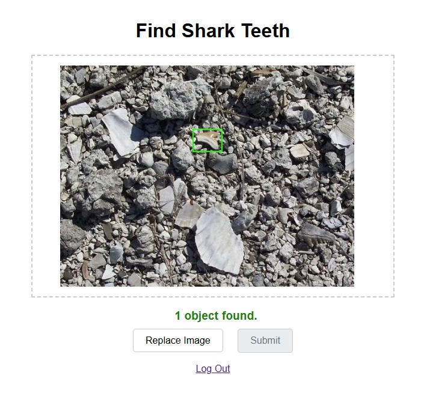
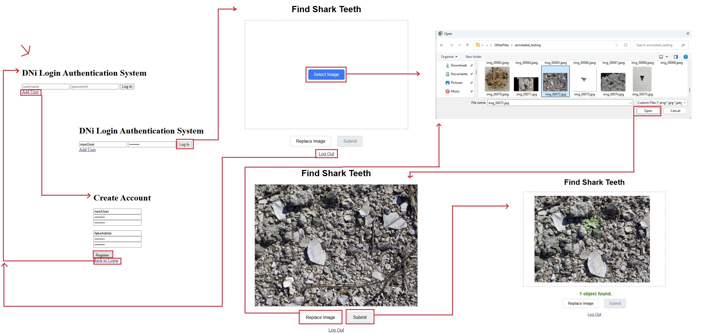

Back to Portfolio: <https://devoreni.github.io/portfolio/><br>
GitHub Project Link: <https://github.com/devoreni/SharkTeethFinder>

# Background

Hunting for shark teeth even in places where they can be found in abundance is still a surprisingly difficult task. Shark teeth are often small, camouflaged, partially obscured, broken, and surrounded by rocks and pebbles of similar size and color. On a first expedition to such a site, one would be considered particularly talented or lucky to find more than a couple of teeth in an entire day. While extraordinarily challenging for the uninitiated, with enough practice some individuals are able to quickly and consistently spot teeth, meaning it is theoretically possible to train a computer vision model to identify and locate them in the sand.


This project attempts to solve that problem end-to-end: from training a custom object detection model on real-world field data, to deploying it behind a secure, accessible web application that anyone can clone and run for themselves.

# Project Requirements

The solution was required to meet the following criteria:

- Cross-Platform Accessibility
    - The model must be available from any device (a phone at the beach, a laptop at home, etc.) as long as internet access is available.
- Real-World Performance
    - The model must match or outperform an inexperienced shark tooth hunter in the field.
- Security
    - Access to the model must be limited to authorized personnel.
    - AWS access and secret keys must never be exposed at any point, including during development.
    - User passwords must be stored securely using modern cryptographic standards.
- User Management 
    - Personnel must be authenticated before they can use the model.
    - Only administrators will have the ability to create new users.
        - Regular users and administrators will have different permissions.
- Portability
    - Anyone must be able to clone the repository, provide their own credentials, and have the system running with minimal friction.

# Solution

## Object Detection

In order to satisfy the cross-platform accessibility requirement, the neural network must be hosted remotely rather than running on the user's device. AWS Rekognition Custom Labels was selected as the detection backbone for several reasons: it provides the compute and a state-of-the-art computer vision framework without requiring dedicated hardware, its free tier is more generous than comparable services such as Roboflow, and trained models can be copied and reused by others. AWS S3 integrates seamlessly with Custom Labels, making dataset storage and versioning straightforward.

### Dataset Collection

The majority of training data was collected from the field site where the program would be used. Shark teeth, pebbles, rocks, and sand were photographed under a variety of lighting and composition conditions. This was supplemented with images sourced from the internet. Every shark tooth in every image was hand-labeled. The final dataset consisted of **341 training images**, **50 testing images**, and **638 individually labeled shark teeth**.

### Iterative Training

Three models were trained in succession, each informed by the shortcomings of the last.

**Model 1** was trained on an initial dataset and produced poor results across the board. It struggled to reliably distinguish teeth from the surrounding debris.

**Model 2** was trained on a significantly expanded dataset. It had strong metrics and could locate shark teeth in photos where the tooth was obvious or somewhat hidden, but it still failed in real-world testing. Neither the testing, nor training images were representative of how a user would actually take a photo in the field.

**Model 3** shifted focus toward real-world conditions, heavily emphasizing photos taken as a user would naturally take them at the site. With the testing images replaced with real-world images, the aggregate metrics were significantly worse than Model 2, but real-world performance improved meaningfully, performing about as well as a novice.

This iterative process highlighted two fundamental lessons in applied machine learning: a model that performs well on a held-out test set is not guaranteed to perform well in deployment if the test set does not faithfully represent the deployment environment; and, the training images must be high quality and representative of the actual use case - garbage in, garbage out.

## Web Application

To make the detection endpoint accessible from any device, a Flask web application serves as the front end. The application uses the **application factory pattern**, defined in `create_app()`, which initializes extensions, registers routes, and handles database setup all within a controlled context. This pattern keeps the application modular and makes it straightforward to run in different environments.

```python
def create_app():
    app = Flask(__name__)
    load_dotenv()
    # ... database configuration, extension initialization ...
    setup_database(app)
    # ... route definitions ...
    return app
```

### Routes

The application exposes four routes:

- **`/`** — The login page. On a `POST` request, the submitted credentials are validated against the database. If valid, `flask-login` logs the user in and redirects them to the home page.
- **`/SharkToothFinder`** — The main application page, protected by `@login_required`. On a `GET` request, an upload interface is rendered. On a `POST` request, the uploaded image is passed to the vision pipeline, and the processed image with bounding boxes is returned to the user as a base64-encoded PNG.
- **`/create_account`** — Allows a new user to be registered, provided a valid admin authenticates to authorize it.
- **`/logout`** — Logs the current user out and redirects to the login page.

## Authentication and Security

Security was treated as a first-class concern throughout the project. No secret keys, AWS credentials, or environment variables were ever committed to the repository. Significant preparation was done prior to the first commit to ensure this remained true for the entire project history.

### Password Hashing

Passwords are hashed using **Argon2**, the winner of the Password Hashing Competition and the current recommended standard for password storage. The `PasswordHasher` in `extensions.py` is configured with explicitly hardened parameters:

```python
ph = PasswordHasher(
    time_cost=3,
    memory_cost=64*1024,
    parallelism=4,
    hash_len=32
)
```

**Pepper** — a secret value stored as an environment variable rather than in the database — is concatenated into the hash input. Even if the database is fully compromised, an attacker cannot crack the passwords without also obtaining the pepper from the server environment. The value of the pepper is chosen by whoever sets up the web app, meaning all hosts should have a different value.

```python
def hash_credentials(p1, p2=''):
    combined = f'{p1}||{p2}||{os.environ.get("PEPPER")}'
    return ph.hash(combined)
```

### Two-Factor Admin Credentials

Admin accounts use a two-password credential scheme. When an admin authenticates during the creation of a new user, both a primary password and a secondary password are required. Both values are combined with the pepper before hashing. This provides a second factor of authentication for privileged operations entirely within the application's own logic, with no dependency on external services. On submission of an incorrect credentials, `sleep(2)` prevents attackers from spamming password guesses.

```python
def verify_credentials(hashed, p1, p2=''):
    combined = f'{p1}||{p2}||{os.environ.get("PEPPER")}'
    try:
        return ph.verify(hashed, combined)
    except (VerifyMismatchError, InvalidHash):
        sleep(2)  # Timing-safe rejection to prevent enumeration
        return False
```

### Session Management

Once a user is successfully authenticated, `flask-login` manages their session via a signed cookie. The signing key is loaded from the `SESSION_COOKIE_SECRET_KEY` environment variable, ensuring it is never hardcoded. The `@login_required` decorator on the home and logout routes ensures that an unauthenticated request is automatically redirected to the login page.

## User and Admin Models

There are two tables in the database: `User` and `Admin`. Both share the same schema, but they serve distinct roles. `User` accounts can access the detection endpoint. `Admin` accounts cannot log into the application directly; instead, they authorize the creation of new users on the account creation page. This separation of concerns means that administrative credentials are never used for day-to-day access, and, regular users cannot create other accounts.

```{mermaid}
erDiagram
    User {
        int id PK
        string username
        string password
    }
    Admin {
        int id PK
        date username
        string password
    }
```

## Database Layer

The application supports two database backends transparently. If a `DATABASE_URL` environment variable is present, it is used as the connection string for a PostgreSQL database. If no `DATABASE_URL` is provided, the application falls back to a local SQLite database. Render, the hosting service used, does not allow for the creation of files so an SQLite database, `.db` file would need to be provided, which is bad practice, even if empty. However, Render provides a free postgress database which can easily be connected. If other hosts allow for file creation, no additional database setup is required. This logic lives entirely within `create_app()`:

```python
db_url = os.environ.get('DATABASE_URL')
if db_url:
    if db_url.startswith("postgres://"):
        db_url = db_url.replace("postgres://", "postgresql://", 1)
    app.config['SQLALCHEMY_DATABASE_URI'] = db_url
else:
    basedir = os.path.abspath(os.path.dirname(__file__))
    app.config['SQLALCHEMY_DATABASE_URI'] = f'sqlite:///{os.path.join(basedir, "sen.db")}'
```

The `postgres://` to `postgresql://` replacement handles a known compatibility issue with older Heroku and Render connection strings, which use the deprecated prefix. Because all database interactions go through SQLAlchemy's ORM, no other code in the application is aware of which backend is active.

### Initial Admin Bootstrap

Admins cannot be created through the web interface — only regular users can be created there, and only with admin authorization. This intentional constraint means the very first admin must be bootstrapped from outside the application. Two mechanisms are provided.

The first is the `INITIAL_ADMINS` environment variable. At startup, `setup_database()` reads this variable, parses it as a JSON array, and creates any admins that do not already exist:

```python
admins_json = os.environ.get("INITIAL_ADMINS")
admins_to_create = json.loads(admins_json)
for admin_data in admins_to_create:
    # Check for existing admin, hash credentials, insert if new
```

The second is a CLI command for operators who prefer not to put credentials in environment variables, or if more admin need to be added after setup.

```bash
flask create-admin <username>
```

This command prompts for both passwords interactively via `getpass`, keeping them out of the shell history entirely.

## Vision Pipeline

The vision pipeline in `vision.py` is responsible for accepting raw image bytes, preparing the image for submission to AWS Rekognition, parsing the response, and drawing bounding boxes on the original image before returning it to the caller.

### Image Preprocessing

Users may upload images in PNG, JPEG, or HEIC format. HEIC is the default photo format on modern iPhones and is not natively supported by OpenCV. The `pillow_heif` library is registered as a PIL opener at import time, allowing HEIC files to be decoded through Pillow and then converted to a NumPy array for OpenCV. It is important to note that OpenCV processes images in BGR color order so the HEIC needs to be converted from RGB to BGR. In the standard `else`, OpenCV does the decoding so the image is loaded into BGR format automatically.

```python
register_heif_opener()

if original_filename.lower().endswith('.heic'):
    pil_image = Image.open(io.BytesIO(image_bytes))
    image_np_rgb = np.array(pil_image.convert('RGB'))
    image = cv2.cvtColor(image_np_rgb, cv2.COLOR_RGB2BGR)
else:
    image_np = np.frombuffer(image_bytes, np.uint8)
    image = cv2.imdecode(image_np, cv2.IMREAD_COLOR)
```

Rekognition supports both `.png` and `.jpg` formats, but regardless of input format, the image is then re-encoded as JPEG for efficiency.

### Detection and Annotation

The AWS Rekognition client is instantiated using credentials loaded from environment variables. The `detect_labels` call returns bounding boxes expressed as fractions of the image dimensions. These are converted to pixel coordinates and used to draw green rectangles directly onto the OpenCV image.



The annotated image and a count of detected objects are returned to the Flask route, where the image is base64-encoded and embedded directly into the rendered HTML response. No image files are ever written to disk.

## Deployment

The application is deployed on **Render**, with a **PostgreSQL** database add-on providing persistent user storage. Render's environment variable management is used to store all secrets: AWS credentials, the pepper, the session cookie key, the database URL, and the initial admin list. None of which appear anywhere in the repository. The application is configured to run via **Gunicorn** in production, as specified in `requirements.txt`.

Because the application is fully driven by environment variables and the database backend is selected at runtime, anyone can clone the repository, provide their own `.env` file, and run the application locally or on their own hosting provider with no code changes required. The README documents all required and optional variables with examples.

# Results

The final iteration of the model achieved performance comparable to that of an untrained human - and while it fell short of the original goal to surpass one, this outcome is still considered a success. Though statistical metrics were collected, they are not featured prominently here; the benchmark performance and field performance diverge significantly, and presenting a headline F1 score without that context obfuscates the model's real-world utility.
The web application is considered fully successful. The codebase adheres to the principles of low coupling and high cohesion: the vision pipeline does not care which Rekognition model or target class is used, and the application does not care whether it is talking to PostgreSQL or SQLite. As a direct consequence of this design, the application is currently configured to use base AWS Rekognition and to detect zebras. This is intentional as an operator cloning the repository to run the system for themselves would not have access to this Custom Labels model and would need to copy the model to their own AWS account using the CopyProjecctVersion operation. Setting a clearly incorrect target class makes it immediately obvious to any operator that two values need to be changed: the Rekognition endpoint and the target class. "Shark Tooth" is not a label in base Rekognition so that also needs to be changed.
From a security standpoint, no secret keys, AWS credentials, or environment variables were exposed at any point in the project's history, including during active development. Significant preparation was done prior to the first commit to establish this guarantee from the outset. User passwords are stored as Argon2 hashes with a server-side pepper, meaning a database breach alone is insufficient to recover credentials. Additionally, administrative operations require a two-factor credential.

## Demo

Users navigate to the site, log in with their credentials, and are presented with the image upload interface. After selecting a photo, the image is submitted to the server, processed through the Rekognition pipeline, and returned with bounding boxes drawn around each detected object. The count of detections is displayed below the image.



## Cost Analysis and Timeline

The AWS free tier provides enough credits to train one model per month. Given that iterative training was central to this project's development approach, this constraint shaped the timeline directly: the first model was trained at the end of month one, the second at the start of month two, and the third at the start of month three, with additional data collection, labeling, and the web application built in between.

The more pressing cost concern was inference. AWS Rekognition Custom Labels charges per inference hour — the model accrues cost while the endpoint is active, regardless of whether it is actively processing images. As real-world testing expanded, projected monthly costs and downtime waiting for credits to refresh grew to a point where continued development could not be justified as the project had already reached a meaningful stopping place.

Alternatives were explored but none were a clear improvement. Roboflow offers free credits, though they do not stretch nearly as far as AWS. It also exposes hyperparameters that Rekognition optimizes automatically, adding complexity without an obvious benefit in return. Roboflow does support negative images whereas Rekognition simply ignores unlabeled images, which is a meaningful distinction. That advantage alone, however, was not enough to justify the switch. Training and hosting a model on owned hardware was also considered, but rising GPU and RAM prices made this option inaccessible.

The project was paused at its current state for these reasons. The total cost incurred was **$1.28**.


# Tools Used

## AWS Rekognition Custom Labels

AWS Rekognition Custom Labels provides a managed computer vision training and inference platform. It handles model architecture selection, training infrastructure, and serving entirely within the AWS ecosystem, making it accessible without dedicated machine learning hardware. S3 integration allows datasets to be uploaded and versioned directly in the AWS console.

## AWS Boto3

The `boto3` library is the official AWS SDK for Python. It is used in `vision.py` to instantiate the Rekognition client and submit inference requests. Credentials are passed explicitly from environment variables rather than relying on ambient AWS credential discovery, making the credential flow transparent and auditable.

## Flask

Flask is a lightweight Python web framework. The application factory pattern used as it is the recommended approach for Flask applications that need to be portable across environments. Flask's extension ecosystem (`flask-login`, `flask-sqlalchemy`, `flask-wtf`) handles authentication, database access, and form validation respectively.

## Argon2-CFFI

Argon2-CFFI provides Python bindings for the Argon2 password hashing algorithm. Argon2 is specifically designed to be resistant to GPU-based brute-force attacks through its configurable memory and time costs. The `PasswordHasher` abstraction handles algorithm versioning internally, meaning stored hashes remain valid even if the recommended parameters are updated in a future version.

## SQLAlchemy / Flask-SQLAlchemy

SQLAlchemy's ORM is used for all database interactions. Defining models as Python classes and using the ORM query interface means the application code is entirely agnostic to whether it is talking to SQLite or PostgreSQL. `Flask-SQLAlchemy` integrates the session lifecycle with Flask's application context, handling connection management automatically.

## OpenCV and Pillow

OpenCV is used for image decoding, bounding box annotation, and re-encoding. Pillow, supplemented by `pillow_heif`, handles HEIC decoding. Together they ensure that images captured on any modern device, including iPhones using the HEIC format, can be processed without requiring the user to convert them beforehand.

## Render

Render is a cloud application hosting platform with native support for Python web applications, managed PostgreSQL databases, and environment variable configuration. It was selected for its straightforward deployment model and free tier, which was sufficient for the scale of this project.

# Future Work

The project reached a meaningful stopping point, but several clear paths forward exist.

## Domain Randomization


## Self-Hosted Training

AWS Rekognition Custom Labels abstracts away the training infrastructure but at the cost of flexibility and, at scale, cost. Training a custom object detection model (such as YOLOv8 or a similar architecture) on owned hardware would eliminate per-inference costs entirely and allow for much finer control over the training process. 

## Roboflow

Roboflow provides a managed computer vision platform with annotation tools, dataset versioning, and model training. The cost structure was prohibitive for this project given the available budget, but with a larger and more carefully curated dataset, the per-image annotation and training costs could be justified by the improvement in model quality and iteration speed.

## Cost Management


## Domain Expansion


